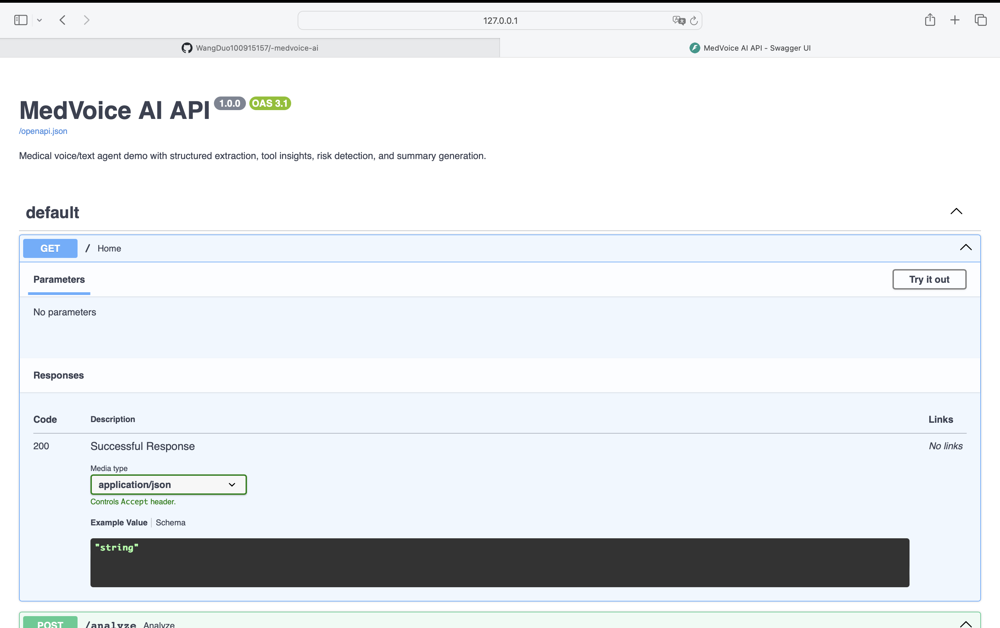
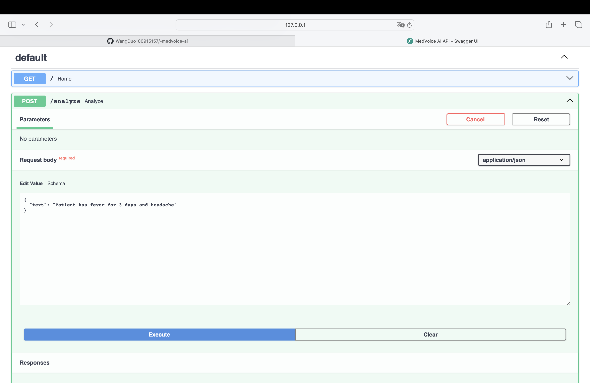

# MedVoice AI

AI-powered medical voice agent system.

## Features

- Extract structured medical data (symptoms, duration)
- Tool-based insights (mock medical knowledge)
- Risk detection
- Clinical summary generation
- FastAPI backend

## API

POST /analyze

Example:

{
  "text": "Patient has fever for 3 days and headache"
}

## Output

{
  "symptoms": ["fever", "headache"],
  "risk": "low",
  "summary": "..."
}

## Run

uvicorn api.server:app --reload

## Demo

### API Overview

### Input Example

### Output Result

